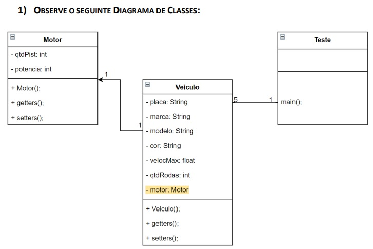
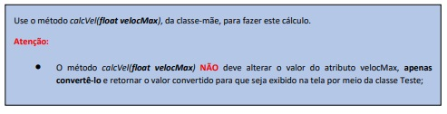
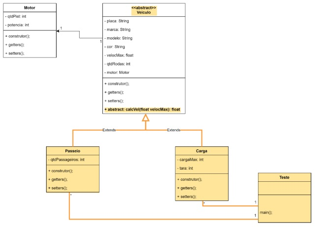

# ☕ Linguagem De Programação Java I..

## Este material foi desenvolvido em resposta a disciplina 'Java I', a qual faz parte do curso de Pós Graduação em Tecnologia Java, ministrado pela Universidade Tecnológica Federal do Paraná.
🎉 Os projetos, são exercícios solicitados ao longo do curso que juntos perfazem a nota que compõem a média final.

🥋 Se você está entrando no Java agora, vou deixar um comentário apenas para orientá-lo, caso considere o código destes exercícios estranho. São vários níveis de dificuldade, a medida que a numeração dos exercícios aumenta, o grau de dificuldade o acompanha. Em especial, foram considerados pelo professor e os demais colegas, os mais HARD são os últimos, embora, tratar-se de um único projeto. Sem exageros e caso não entenda de primeira, continue tentando, pois, o sucesso não só reside nos melhores, más também, nos persistentes, que considero meu caso (_😎tirei nota máxima em quase todos_♻️rsrsrs). Desenvolver software, nada mais é que descartar a possibilidade de desistência (se for necessário, re-comece, quantas vezes precisar...), independente de qualquer motivo!

## Entregas..

✏️ Atividade 01: Desenvolver uma aplicação em linguagem Java, respeitando o que se pede:

👨‍💻 Requisitos:

    👉 a. Todos os métodos construtores default (que não possuem parâmetros formais em sua assinatura) deverão iniciar com 0 (zeros) atributos que sejam de tipos numerais (int, double, float, etc.) e com  espaço em branco (“ “) aqueles que forem de tipo literais (char, String e etc).

    👉 b. A classe “Teste” deve ser construída de forma a testar todas as funcionalidades do programa. Nesta deverão ser implementadas as entradas de dados e a impressão destes na tela. Por meio dela  deverá ser possível instanciar 5 veículos.

    👉 c. Perceba que, de acordo com as associações descritas no diagrama de classes e suas cardinalidades, a classe “Teste” irá conter apenas objetos do tipo “Veiculo”. Em momento nenhum deverá conter  objetos do tipo Motor. No entanto deverá, por meio de um objeto do tipo Veiculo, instanciar os atributos do objeto atributo motor, contido na classe Veiculo, que é do tipo Motor.

    👉 d. Perceba que a classe Veículo POSSUI um atributo do tipo Motor.
  
🕵️ Orientações adicionais:



✏️ Atividade 03: Embora a Atividade 3 trate do conceito e aplicação do mecanismo de Herança, ela também pode nos ajudar compreender a realidade das empresas e instituições que buscam intensificar o uso de  padrões de projetos desenvolvidos, de maneira ad hoc, por elas mesmas, com intuito de padronizar a construção de seus softwares. Por exemplo, ao definir-se como "final" um método "set", indicando que não  poderá ser sobrescrito, garantimos a perpetuação de uma regra de negócio restritiva sobre as características possíveis de um objeto (um atributo deste), como quando não queremos que um atributo receba um  valor fora de uma escala prevista.

👨‍💻 Requisitos: Desenvolva novos elementos a partir da Atividade 01

    👉 a. A “entrada” da velocidade (atributo velocMax) sempre será dada em km/h porém, a exibição destes dados ocorrerá na classe Teste e da seguinte forma:
        i. A velocidade do veículo de passeio deverá ser calculada em m/h. 1 kilometer/hour = 1000 meter/hour
        ii. A velocidade do veículo de carga deverá ser calculada em cm/h. 1 kilometer/hour = 100000 centimeter/hour



    👉 b. Os métodos construtores default deverão iniciar com 0 (zeros) atributos que sejam de tipos numerais (int, double, float, etc.) e com espaço em branco os que forem de tipo literais (char, String e  etc.)

    👉 c. Garanta que nunca ocorra:
        i. As classes Passeio e Carga jamais deverão ser estendidas (herdadas);
        ii. Nenhum método “set” poderá ser sobrescrito;

    👉 d. A classe “Teste” deve ser construída de forma a testar todas as funcionalidades do programa (entrada, saída e cálculos), propiciando assim “trocas de mensagens” entre os objetos das classes  Teste→Passeio e Teste→Carga. Por meio dela deverá ser possível instanciar 5 veículos de cada tipo (Passeio/Carga).
  
🕵️ Orientações adicionais: Novos elementos encontram-se em amarelo



✏️ Atividade 04: Herança Múltipla - Existem linguagens de programação que suportam, entretanto, não é o caso do Java. Para resolver esta situação, em Java, desenvolveu-se uma estrutura de dados denominada Interface

👨‍💻 Requisitos:

    👉 a. Proceguindo com a atividade 03, A classe Teste deverá conter o Menu Inicial com as seguintes opções (e suas funcionalidade desenvolvidas):
    
        Observações sobre as opções do Menu Inicial:
            • Opções 5 e 6: O usuário informa a placa do veículo e o programa deve executar uma busca no vetor do respectivo tipo de veículo e imprimir os dados deste;
            • Opção 7: o sistema será encerrado apenas quando o usuário escolher esta opção.
            
    👉 O Sistema deverá permitir:
        a. A cada operação realizada no sistema, este retornará ao Menu Inicial;
        b. Armazenar 5 de veículos de cada tipo. Crie 2 vetores, um para os veículos de passeio e outro para os de carga;
        c. Ao inserir um novo veículo o sistema deverá verificar se já existe um veículo cadastrado com a mesma placa. Caso exista, deverá informar ao usuário sobre esta existência e deverá voltar ao Menu
        Inicial.
        d. Ao final do cadastro de cada veículo, deverá ser perguntado se deseja cadastrar mais um (do mesmo tipo), caso a resposta seja NÃO deverá voltar ao Menu Inicial;
        e. A velocidade de cada veículo sempre será armazenada em Km/h, porém o método abstrato calcVel (sobrescrito nas classes Passeio e Carga) deverá calcular (não alterando o valor do atributo
        velocMax) e  retornar o resultado da seguinte forma: se o veículo for de passeio, deverá converter de Km/h para M/h (metros por hora) e retornar este valor. 1 kilometer/hour = 1000 meter/hour
    
    Sistema de Gestão de Veículos - Menu Inicial
        1. Cadastrar Veículo de Passeio
        2. Cadastrar Veículo de Carga
        3. Imprimir Todos os Veículos de Passeio
        4. Imprimir Todos os Veículos de Carga
        5. Imprimir Veículo de Passeio pela Placa
        6. Imprimir Veículo de Carga pela Placa
        7. Sair do Sistema


    👉 b. A classe “Teste” deve ser construída de forma a testar todas as funcionalidades do programa. Nesta deverão ser implementadas as entradas de dados e a impressão destes na tela. Por meio dela  deverá ser possível instanciar 5 veículos.

    👉 c. Perceba que, de acordo com as associações descritas no diagrama de classes e suas cardinalidades, a classe “Teste” irá conter apenas objetos do tipo “Veiculo”. Em momento nenhum deverá conter  objetos do tipo Motor. No entanto deverá, por meio de um objeto do tipo Veiculo, instanciar os atributos do objeto atributo motor, contido na classe Veiculo, que é do tipo Motor.

    👉 d. Perceba que a classe Veículo POSSUI um atributo do tipo Motor.
  
🕵️ Orientações adicionais:


### 📽️ Click na imagem e assista ao vídeo de apresentação do Projeto..     

[](https://www.youtube.com/watch?v=2_WtivOfl_M)

# Tecnologia utilizada:


## Tabela de Conteúdos

- [Instalação](#Instalação)
- [Uso](#Uso)
- [Contribuição](#Contribuição)

## Instalação

1. Clone o repositório ou baixe o arquivo .zip:

```bash
git clone https://github.com/alfecjo/Java-II.git
```
## Uso

1. Execute em sua IDE de preferência. Contudo, o desenvolvimento foi feito no IntelliJ! Você pode começar com: "mvn install", no diretório raiz, que é onde se encontra o
   arquivo pom.xml. Desta forma, serão baixadas as dependências, caso seja necessário.

## Contribuição

Contribuições são bem-vindas! Se você encontrar algum problema ou tiver sugestões de melhorias, abra um problema ou envie uma solicitação pull ao repositório.

Ao contribuir para este projeto, siga o estilo de código existente, [convenções de commit](https://www.conventionalcommits.org/en/v1.0.0/), e envie suas alterações em um branch separado.

Muito obrigado!!


# ☕  Java I

## Objetivo

### 🌱 O objetivo geral foi desenvolver e cumprir os requisitos estabelecidos pelo cronograma da disciplina Java I.

## 📫 REQUISITOS:
  
### ⚡ LISTA DE REQUISITOS A SEREM SEGUIDOS:

I) Há diversos requisitos que envolvem a programação. Todos representados por UML que indicam todas
as características de construção;

II) Em cada atividade, bem como, na prova, é disponibilizado um arquivo .pdf;

III) Toda a regra de negócio se encontra dentro destes arquivos. Para total compreendimento:

- abra o pdf em uma janela;
- abra o projeto em outra janela. Preferencialmente, use IDE Netbeans 13 com JDK 17 e caso deseje outra IDE,
  promova as modificações necessárias;
- As atividades foram desenvolvidas em Shell até completar todos os requisitos ofertados nos enunciados, de
  forma que a atividade 02 é uma evolução da atividade 01 e assim por diante até que todos os requisitos
  forem cumpridos. Deste ponto em diante, o próximo requisíto é:

VI) A elevação do projeto que se encontra na modalidade shell, ou seja, tem a apresentação e execução no 
formato DOS ou para alguns, Windows CMD;

V) Não utilizará interface gráfica nesta prova.

VI) A partir deste ponto, toda aplicação construida no formato shell, passa a ser transformada para o
formato visual Windows, onde são utilizados diversos controles, os quais correspondem a sua construção.

VII) Por fim, a avaliação, a qual a disciplina se submete;

VIII) Todos os codigos apresentados aqui foram entregues exatamente como são vistos. Não foram modificados,
nem tão pouco houve a necessidade de correção, pois todas as atividades entregues atingiram nota máxima;

#### ⚡ Para execução de cada atividade:

- As atividades foram construidas cronologicamente em momentos futuros. Isso implica em uma hierarquia
  cronológica, portando, embora funcionem individualmente. Para completo intendimento se faz necessário
  copiar o repositório e executar ordenando por tempo, passando pela atividade 01, consequênte a 02 e
  assim por diante:

- A cópia do material é de domínio público, contudo, há utilize de forma inteligente.
  
- Caso pretenda fazer as entregas para o curso, se utilizando do mesma codificação, saiba
  que há algoritmos capaz de verificar entregas passíveis de cópia, sem falar que é de total despropósito
  passar pelo curso sem aprender, pois, um dia, quando for cobrado, terá bagagem suficiente e será
  reconpensado pelo esforço.

- Espero ter contribuido e boa sorte!!!
